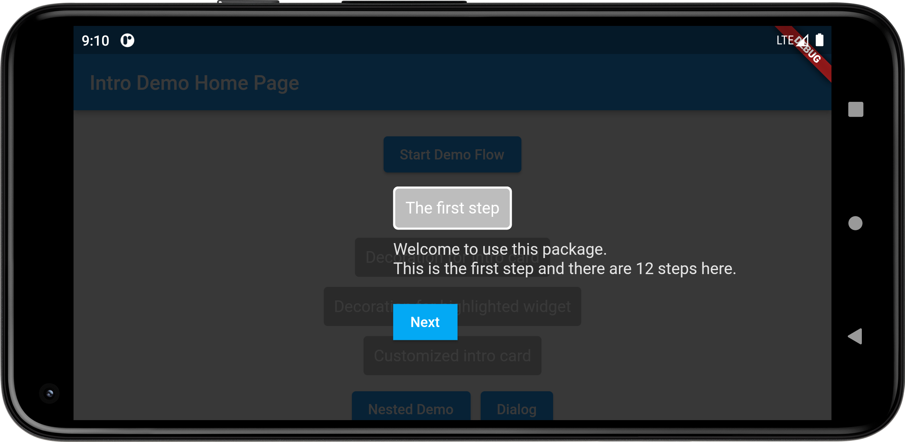
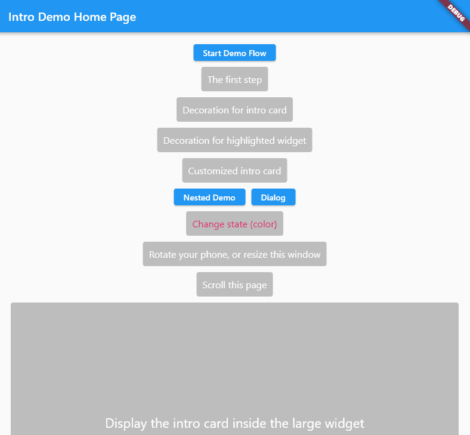
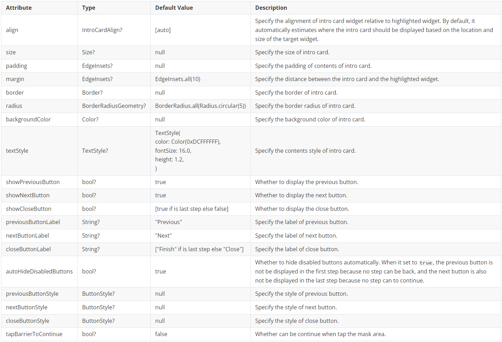

# intro

A step-by-step wizard, which can help you to introduce your product or to demonstrate the usage of your application.


## Features

- Step by step demonstration
- Control the demo flow
- Highlight the target widget
- Automatically calculates the location and alignment of intro card
- Customizable style and behavior
- Supports nesting of multiple demo flow
- Link between different pages or dialogs
- Full platform support


## Demo






## Getting started

Add this package to your project.

```shell
flutter pub add intro
```

Import it in your code.

```dart
import 'package:intro/intro.dart';
```


## Usage

1. Register the `Intro` widget at the earliest possible widget tree node.

   Provide a `IntroController` that has specified the `stepCount`. The `stepCount` refers to the total number of steps in the demo flow.

```dart
runApp(Intro(
  controller: IntroController(stepCount: 5),
  child: MaterialApp(
    home: HomePage(),
  ),
));
```

2. Wrap the `IntroStepTarget` widget around each of your target widgets that you need to introduce.

```dart
IntroStepTarget(
  step: step,
  controller: Intro.of(context).controller,
  cardContents: TextSpan(
    text: "The introductory text of this step.",
  ),
  child: targetWidget,
);
```

3. Start the demo flow at the right time.

```dart
Intro.of(context).controller.start(context);
```


### **Decoration for intro card**

Provid a `IntroCardDecoration` object in the `cardDecoration` field of the `IntroStepTarget` widget (specific step target) or the `Intro` widget (global) to describe the style or behavior for intro card.

Globally effective:

```dart
Intro(
  cardDecoration: IntroCardDecoration(
    // TODO:
    // Some attributes that need to be specifically specified.
    // For missing attributes , they will use its default value.
  ),
  // ...
);
```

Only effective for specific step:

```dart
IntroStepTarget(
  cardDecoration: IntroCardDecoration(
    // TODO:
    // Some attributes that need to be specifically specified.
    // For missing attributes , they will use global value (be specified in `Intro`).
  ),
  // ...
);
```

Attributes for `IntroCardDecoration` :




### **Decoration for highlighted widget**

Provid a `IntroHighlightDecoration` object in the `highlightDecoration` field of the `IntroStepTarget` widget (specific step target) or the `Intro` widget (global) to describe the style for highlighted widget.

Globally effective:

```dart
Intro(
  highlightDecoration: IntroHighlightDecoration(
    // TODO:
    // Some attributes that need to be specifically specified.
    // For missing attributes , they will use its default value.
  ),
  // ...
);
```

Only effective for specific step:

```dart
IntroStepTarget(
  highlightDecoration: IntroHighlightDecoration(
    // TODO:
    // Some attributes that need to be specifically specified.
    // For missing attributes , they will use global value (be specified in `Intro`).
  ),
  // ...
);
```

Attributes for `IntroHighlightDecoration`:


### **Controller**

You can control the demo flow through the `IntroController` instance.

Get the instance:

*You can define the controller instance as a global variable to make it easier to use throughout your program. Or, you can get the controller instance through `Intro.of(context).controller`.*

```dart
final controller = Intro.of(context).controller;
```

Get total number of steps:

```dart
controller.stepCount;
```

Get current status:

```dart
controller.isOpened;
```

Start, close and destroy:

*Start this demo flow.*

```dart
controller.start(context);
```

*You can specify a initial step through `initStep` parameter.*

```dart
controller.start(context, initStep: 3);
```

*Stop this demo flow.*

```dart
controller.close();
```

*Destroy this demo flow. Note that it can never be used again when it destroyed.*

```dart
controller.dispose();
```

Jump step:

*Jump to next step. It's equivalent to `close()` if called at the last step.*

```dart
controller.next();
```

*Jump back previous step.*

```dart
controller.previous();
```

*Jump to specific step.*

```dart
controller.jumpTo(5);
```

Manually refresh.

```dart
controller.refresh();
```


### **Customized intro card**

If you don't like the default intro card style, you can customize it through `IntroStepTarget.custom` constructor.

```dart
IntroStepTarget.custom(
  step: step,
  controller: controller,
  cardDecoration: IntroCardDecoration(...),
  cardBuilder: (BuildContext context, IntroParams params, IntroCardDecoration decoration) {
    // Build your card widget.
    // You can use the `params` to get more information or to implement more functionality.
    // You can also use the `decoration` to decorate your card widget. It was defined above or by `Intro` widget.
    return ...;
  },
  child: child,
);
```

Attributes for `IntroParams`:


### **Event-handling**

You can do something (such as open a page, pop a dialog, update widget, load resources etc.) at the right time.

- There are five event-handling callbacks are provided. 
- They are defined in the `IntroStepTarget` widget. 
- These callbacks can be synchronous or asynchronous.

```dart
IntroStepTarget(
  onTargetLoad: () {
    // It will be called when the target widget was built.
  },
  onTargetDispose: () {
    // It will be called when the target widget was disposed.
  },
  onHighlightTap: () {
    // It will be called when tap the highlighted widget.
  },
  onStepWillActivate: (int fromStep) {
    // It will be called when the demo flow reaches the current step.
    // The current step is finally activated only when this callback execution is complete.
    // The `fromStep` tells you from which step it jumped to the current step.
    // In particular, the value of `fromStep` is '0' means that this is the beginning.
  },
  onStepWillDeactivate: (int willToStep) {
    // It will be called when the demo flow leaves the current step.
    // The current step is finally deactivated only when this callback execution is complete.
    // The `willToStep` tells you which step it will to jump to.
    // In particular, the value of `willToStep` is '0' means that this is the ending.
  },
  // ...
);
```


### **Nested**

You can have multiple demo flows in your program. The same target widget may be used in different demo flow.

Step:

1. Define each controller.

   In this case, you may not be able to get the `IntroController` exactly from `Intro.of(context).controller`. So, it's a good idea to save each controller separately beforehand.

```dart
final controller1 = IntroController(stepCount: 5);
final controller2 = IntroController(stepCount: 3);
```

2. Register echo`Intro` widget. Each one uses a separate controller.

```dart
Intro(
  controller: controller1,
  child: Intro(
    controller: controller2,
    child: MyApp(),
  ),
);
```

3. Bind the step target widgets for each demo flow separately.

   If a target widget is used by multiple demo flow simultaneously, it can be nested build with two `IntroStepTarget`.

```dart
IntroStepTarget(
  controller: controller1,
  step: 1,
  // ...
  child: IntroStepTarget(
    controller: controller2,
    step: 3,
    // ...
    child: targetChild,
  ),
);
```

4. Perform operations on each controller individually.


### **Top Layer**

The `topLayerBuilder` of `Intro` is provided for you to create custom widgets at the top layer. For example, you can build a global exit button.

```dart
Intro(
  topLayerBuilder: (context, controller) {
    return Padding(
      padding: const EdgeInsets.only(top: 20, left: 20),
      child: TextButton(
        onPressed: controller.close,
        child: const Text("Exit"),
      ),
    );
  },
  // ...
);
```


### **Other**

Change barrier color or animation duration.

```dart
Intro(
  barrierColor: Colors.black87,
  animationDuration: Duration(milliseconds: 500),
  // ...
);
```


------

*To see the full demonstration or more advanced features, read the example code please.*
